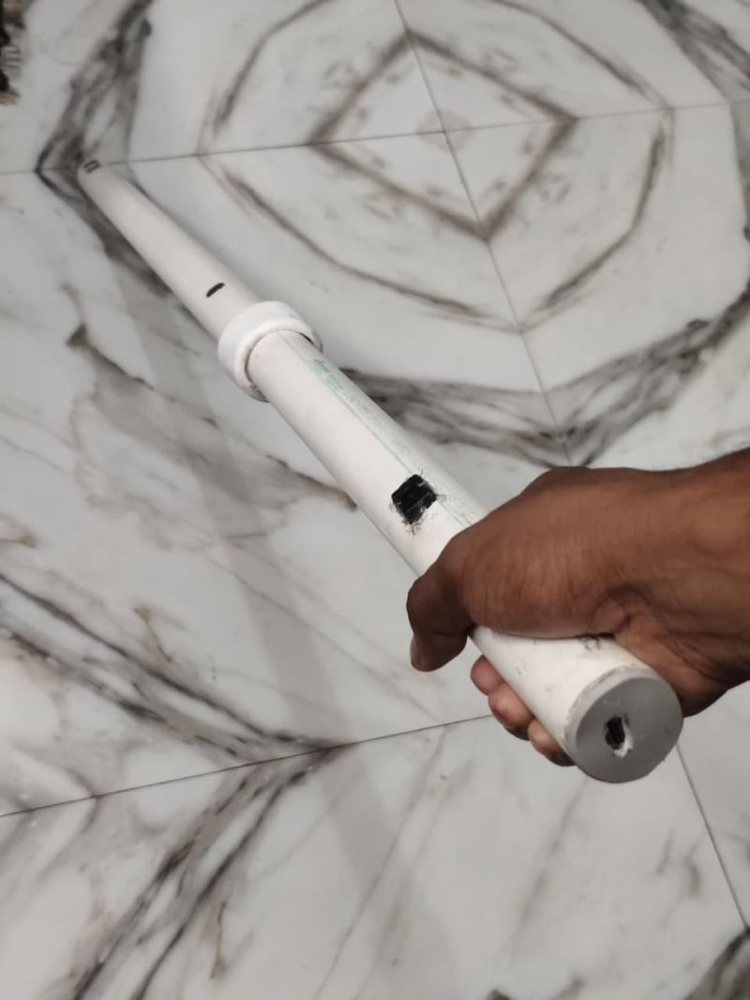
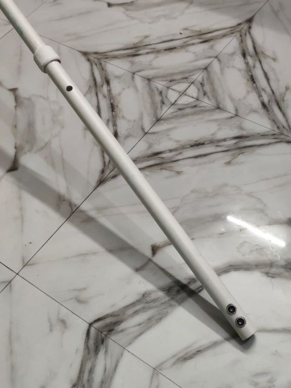
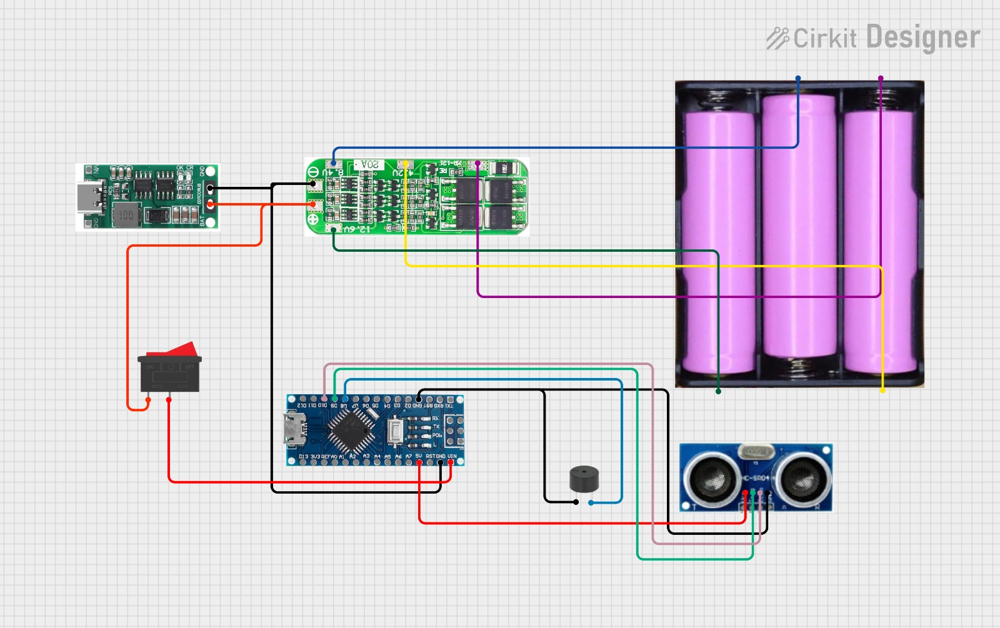

# Smart-Blind-Stick
# Smart Blind Stick

A **Smart Blind Stick** developed using **Arduino Nano**, **HC-SR04 Ultrasonic Sensor**, **Active Buzzer**, and a **3S Li-ion Battery Pack with 20A BMS**. The system helps visually impaired people detect obstacles in front of them and provides an audio alert through a buzzer.

---

## 📌 Project Overview

This project uses an ultrasonic sensor to continuously measure the distance of nearby objects. When an obstacle comes within a predefined range, the Arduino activates a buzzer to warn the user. The stick is rechargeable using a **Type-C charging module** and includes a **power switch** for easy operation.

---

## ✨ Features

* 🔍 Obstacle detection using **HC-SR04 ultrasonic sensor**
* 🔊 Audio alert using **active buzzer**
* 🔋 Rechargeable **3S Li-ion battery pack (11.1V)**
* ⚡ **Type-C charging support**
* 🎚️ ON/OFF power switch
* 🦯 Lightweight PVC pipe body for portability

---

## 🛠️ Components Used

| Component                 | Quantity |
| ------------------------- | -------- |
| Arduino Nano              | 1        |
| HC-SR04 Ultrasonic Sensor | 1        |
| Active Buzzer             | 1        |
| 3.7V Li-ion Batteries     | 3        |
| 20A 3S BMS                | 1        |
| Type-C Charging Module    | 1        |
| Power Switch              | 1        |
| PVC Pipe (Stick Body)     | 1        |

---

## 🔌 Circuit Connections

| HC-SR04 | Arduino Nano |
| ------- | ------------ |
| VCC     | 5V           |
| GND     | GND          |
| TRIG    | D9           |
| ECHO    | D10          |

| Buzzer | Arduino Nano |
| ------ | ------------ |
| +      | D8           |
| -      | GND          |

Power Supply:

* **3S Li-ion Battery Pack → 20A BMS → Switch → Nano VIN**
* **BMS P- → Nano GND**

---

## 💻 Arduino Code

The main Arduino sketch is available in:

```
Code/Code.ino
```

The code performs:

* Distance measurement using ultrasonic pulses
* Obstacle detection
* Different buzzer alert patterns based on distance

---

## 📷 Project Images

### Smart Blind Stick



### Type-C Charging Port



### Circuit Diagram



---

## 🚀 How to Run

1. Install **Arduino IDE**.
2. Select **Tools → Board → Arduino Nano**.
3. Select **ATmega328P (Old Bootloader)** if using a Nano clone.
4. Open `Code/Code.ino`.
5. Upload the code to the Arduino Nano.
6. Power the system using the 3S battery pack.

---

## 📖 Working Principle

1. The **HC-SR04** sends ultrasonic waves.
2. The waves reflect from nearby obstacles.
3. The Arduino calculates the distance from the echo time.
4. The **buzzer alert speed increases as the obstacle gets closer**.

---

## 🎯 Applications

* Assistive device for visually impaired people
* Obstacle detection systems
* Embedded systems and Arduino learning projects
* IoT and sensor-based prototype development

---

## 👨‍💻 Author

**Suraj Gupta**

* B.Tech in **Electronics & Communication Engineering (ECE)**
* Haldia Institute of Technology
* GitHub: [thesuraj-gupta](https://github.com/thesuraj-gupta)

---

## 📜 License

This project is created for **educational and demonstration purposes**. Feel free to use and modify it for learning and research activities.
